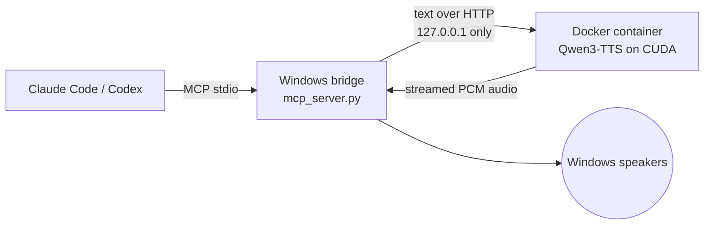

# Local Qwen Voice

**Give Claude Code and Codex a voice.** Local Qwen Voice is an MCP server that
lets your AI coding assistant talk back. After each answer it reads a short
summary aloud in a natural voice, tells you when it needs your input and
announces when a long build or test run finishes. Everything runs on your own
NVIDIA GPU: no cloud speech service, no API key, no subscription.

Built by **[Bitwise Anvil LLC](https://bitwiseanvil.com/)**. If you like what
you see, [let's talk](#work-with-bitwise-anvil) about what we can build for you.

Pair it with **[Whisper Pause/Break](https://github.com/BitwiseAnvil/whisper-pause-break)**,
local push-to-talk dictation, for hands-free conversations with your CLI tools:
hold a key to talk, release, and hear the answer.

## What it does

- **Speaks without being asked.** The server tells connected assistants when to
  speak: a 1-3 sentence summary after each final answer, a heads-up when they
  are waiting on you, and a notice when a long task finishes or fails. Code,
  file paths and tables stay on screen.
- **Starts talking fast.** Audio streams while it is still being generated.
  On an RTX 5090, the first audio typically plays in about a quarter of a
  second, and speech generates about three times faster than real time.
- **Designs its own voice.** Qwen3-TTS VoiceDesign creates a voice from a text
  description, such as *"a warm, unhurried American voice with a clear
  middle register"*. No recording of a real person is needed. Ask the assistant
  to design more voices at any time.
- **Stops when you say so.** Say "stop" or "quiet" and speech cancels
  immediately for that reply.
- **Stays private.** Text goes only to a container on `127.0.0.1`. After the
  models download, you can turn off network access to Hugging Face entirely.
- **Works with Claude Code and Codex CLI.** Registration scripts set up both,
  plus ChatGPT Desktop, which shares Codex's MCP configuration.

## How it works



1. The assistant calls `speak` with a summary. The Windows bridge queues it and
   returns a job ID right away, so the assistant can keep working or stop it.
2. The Docker container generates speech on the GPU with
   [faster-qwen3-tts](https://github.com/andimarafioti/faster-qwen3-tts) CUDA
   graphs and streams small PCM frames back as they are produced.
3. The bridge plays frames through one continuously open Windows audio device
   while the rest of the reply is still generating.

The bridge runs on Windows, outside Docker, because the Linux container can't
use the Windows speakers. It uses only Python's standard library and the
Windows audio API. All model inference runs in the container; there is no CPU
inference path.

## Requirements

- Windows 10 or 11 with Docker Desktop using the WSL2 backend and GPU support.
- An NVIDIA GPU and a current driver that supports CUDA 13. Developed and tested
  on an RTX 5090; peak GPU memory measured about 4.7 GB. Other recent NVIDIA GPUs
  should work if the PyTorch CUDA 13 build supports them.
- PowerShell 7 and Python 3.12 or 3.13 on Windows.
- Claude Code and/or Codex CLI.

## Get started

1. **Start the engine.** From this folder, in an ordinary PowerShell terminal:

   ```powershell
   .\scripts\start.ps1
   ```

   This builds and starts the container, downloads the models, designs the
   default voice, then plays a benchmark sample. The first run downloads
   several GB and can take several minutes. Later starts reuse the cached
   models. `-SkipSample` skips the benchmark; `-NoBuild` reuses the existing
   image.

2. **Register the server** for every project, from a normal PowerShell terminal
   under your own Windows account:

   ```powershell
   .\scripts\register-global.ps1                 # Claude Code and Codex
   .\scripts\register-global.ps1 -Client Claude  # or just one
   .\scripts\register-global.ps1 -Client Codex
   ```

   `-CheckOnly` previews what would be registered without changing anything.

3. **Codex only:** copy [`docs/codex-AGENTS.md`](docs/codex-AGENTS.md) into
   `%USERPROFILE%\.codex\AGENTS.md`, merging it with any existing content.
   Codex doesn't read MCP server instructions, so this file tells it when to
   speak. Claude Code needs no extra step.

4. **Restart** Claude Code and Codex, then ask them anything. You should hear a
   short spoken summary.

## When it speaks

Claude Code receives these rules from the server's MCP instructions. Codex reads
the same rules from its global `AGENTS.md`.

- After every final answer, a 1-3 sentence spoken summary of the key outcome.
- When blocked waiting for your answer, approval or decision. Claude Code's own
  permission pop-ups are outside what the assistant can see, so it can't
  announce those.
- When a long-running task such as a build, test run or install finishes or fails.
- Always in the default voice from `config/voice.json`, unless you ask for another.
- "Stop" or "quiet" silences the current reply; asking for no speech at all
  silences it until you ask again.

**For maintainers:** the rules live in two places that must stay in sync:
`INSTRUCTIONS` in `local_voice/mcp_server.py` (Claude Code, which truncates
server instructions at about 2 KB) and `docs/codex-AGENTS.md` (Codex). Restart
open sessions after changing them.

## Tools

| Tool | Purpose |
| --- | --- |
| `speak(text, voice?)` | Queue a complete response, up to 4000 characters, and stream it to the speakers while generating. |
| `stop_speaking()` | Stop audio and cancel pending speech or voice-design jobs. |
| `speech_status(job_id?)` | Job state (queued, generating, playing, completed, failed or cancelled) plus GPU health. |
| `list_voices()` | List saved voices and their descriptions. |
| `design_voice(name, description)` | Queue creation of a new reusable voice. |

A whole spoken summary goes in one `speak` call. Long text is split internally
into segments of up to 800 characters, and each segment generates while the
previous one plays. A bounded buffer holds about three seconds of audio ahead.
Cancellation flushes the device, interrupts the HTTP read and stops the decoder
at the next audio frame.

## Voice design

The default voice is defined in [`config/voice.json`](config/voice.json): a
name, a text description, a reference sentence and a seed. On first start,
Qwen3-TTS VoiceDesign generates reference audio from that description. The
Base model then reuses that reference for every reply, so the voice stays
consistent.

To change the default, edit `config/voice.json` with a **new name** and run
`docker compose restart tts`, then restart your assistants. Existing voices are
kept. Or ask the assistant:

> Design a new voice named `warm_british` with a warm British female voice, then
> check that the design job completed and speak a sample using that voice.

VoiceDesign and Base are separate 1.7B checkpoints. Only one is kept in GPU
memory at a time. Saved voices record the design prompt, transcript, seed and
resolved model revision. Add `design_revision` and `base_revision` commit hashes
to the voice config to pin model snapshots; the default uses `main`.

## Configuration

Copy `.env.example` to `.env` to change these settings:

| Setting | Default | Meaning |
| --- | --- | --- |
| `TTS_GPU_DEVICE` | `0` | Docker GPU index, or a GPU UUID from `nvidia-smi -L`. |
| `TTS_EXPECTED_GPU` | *(empty)* | If set, refuse to start unless the GPU name contains this text, e.g. `RTX 5090`. |
| `TTS_PORT` | `8765` | Port published on `127.0.0.1` only. |
| `TTS_CHUNK_FRAMES` | `4` | Codec frames per packet, 1-12, about a third of a second of audio at 4. Smaller can start sooner at more overhead. |
| `HF_HUB_OFFLINE` | `0` | Set to `1` after both models are cached to block Hugging Face access. |

The bridge reads the same `TTS_PORT` from `.env`; `TTS_URL` can override it with
another localhost URL. Changes take effect after `docker compose up -d`.

Downloaded weights live in the `model-cache` Docker volume and voices in
`voice-data`. `docker compose down` keeps them; `docker compose down -v` deletes
them. Playback stays in memory; only the benchmark sample is saved, to
`.runtime/voice-sample.wav`.

## Verify and diagnose

```powershell
.\scripts\smoke.ps1 -UnitOnly  # dependency-free tests and Compose validation
.\scripts\smoke.ps1 -Play      # also verifies real CUDA synthesis and plays it
python -m local_voice.cli benchmark --runs 3 --play --require-interactive
python -m local_voice.cli health
docker compose logs --tail 100 tts
docker compose stop
```

The benchmark requires first audio within one second, generation faster than
playback and no playback underruns, and saves results to
`.runtime/streaming-benchmark.json`. It reports the GPU, CUDA tensor count,
graph capture, model revision, peak CUDA memory, first-audio timing and
real-time factor. A `real_time_factor` below 1 means faster than playback.
`first_playback_ms` is when the first buffer reached Windows audio, including
any time queued behind other jobs.

The benchmark rejects silent, malformed or truncated audio, but it can't judge
pronunciation or voice quality; listen to the sample for that. Unit tests cover
HTTP streaming, buffer lifetime, overlapping generation and playback,
cancellation, error handling and the MCP handshake without a GPU.

If Docker reports permission denied for `dockerDesktopLinuxEngine`, run the
command from your normal Windows terminal where Docker Desktop is accessible.
After updating the code, rebuild with `.\scripts\start.ps1` and restart your
assistants so their running bridge picks up the change.

## Built on

| Project | License |
| --- | --- |
| [Qwen3-TTS](https://github.com/QwenLM/Qwen3-TTS) models: 12Hz 1.7B Base and VoiceDesign | Apache-2.0 |
| [faster-qwen3-tts](https://github.com/andimarafioti/faster-qwen3-tts) | MIT |
| [PyTorch](https://pytorch.org/) CUDA 13 wheels | BSD-style |
| [Model Context Protocol](https://modelcontextprotocol.io/specification/2025-06-18/basic/transports) | Specification |

Model weights are downloaded from Hugging Face at first start and are not part
of this repository.

## About this project

Local Qwen Voice was designed and written with substantial help from AI tools,
including Claude Code and Codex, and is tested on the author's own Windows and
RTX 5090 setup. It is shared as a working example and a useful tool, provided
"as is" without warranty. Issues and pull requests are welcome.

## Work with Bitwise Anvil

Local Qwen Voice is built by **[Steven Cheatham](https://stevencheatham.com/)**
of **[Bitwise Anvil LLC](https://bitwiseanvil.com/)**: *Precision software,
forged at AI speed.*

This project is a working example of what we do: dependable, thoroughly
tested systems, engineered with AI and built to last. Bitwise Anvil offers
systems architecture, advisory, custom development, custom web development,
AI agents and system audits.

- **Work with Bitwise Anvil:** [bitwiseanvil.com](https://bitwiseanvil.com/) ·
  [contact@bitwiseanvil.com](mailto:contact@bitwiseanvil.com)
- **Connect with Steven:** [LinkedIn](https://www.linkedin.com/in/stevencheatham/) ·
  [X](https://x.com/StevenCheatham) ·
  [steven@stevencheatham.com](mailto:steven@stevencheatham.com)

If this project helped you, a ⭐ on GitHub helps others find it.

## License

[MIT](LICENSE).
